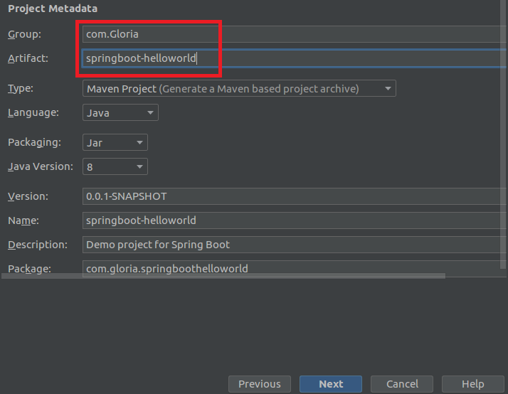
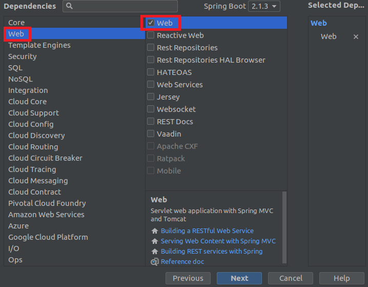
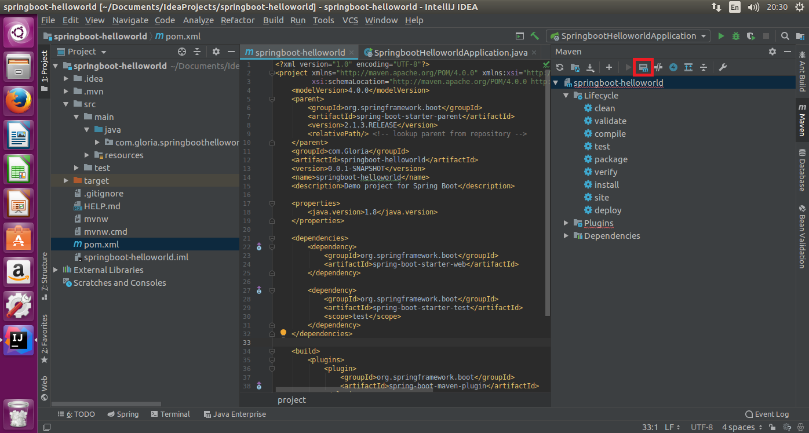
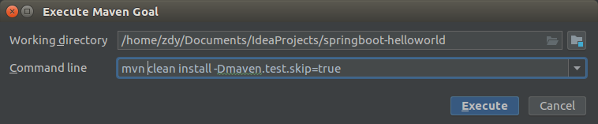
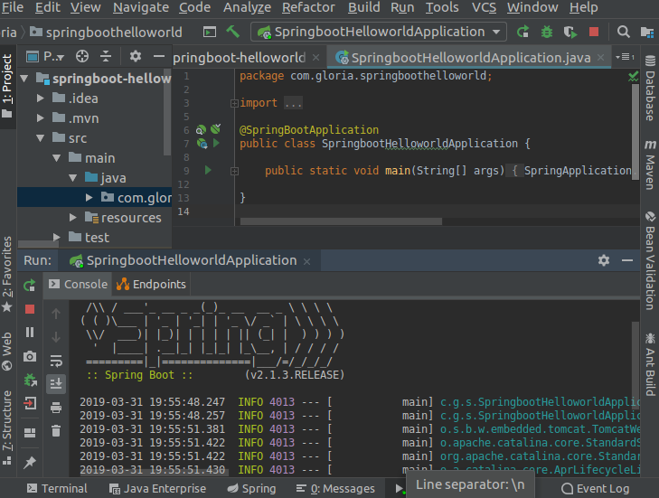

### Spring-boot的启动过程记录

1.新建一个新程序

2.填好group和artifact

3.如图勾选

4.自动创建好之后，点击pom.xml文件，点击界面右侧竖边框的maven，然后点击红框的按钮

5.输入如下指令，直到“build success”

6.运行SpringbootHelloworldApplication.java文件，结果如下所示

这其中因为界面大小太小了，按照[https://www.cnblogs.com/clc2008/p/6801465.html](https://www.cnblogs.com/clc2008/p/6801465.html)所说安装了VMware Tools，不仅使界面适应屏幕，还可以实现本地机与虚拟机文件的传输，nice！！~~

但是呢，这种利用IDEA自动构建的成功了，之前照网上所说的新建Maven工程来创建springboot的helloworld没有成功，如果找到解决方法会更新此文的~~
